# Yosuljin

> Aether is a private technological ecosystem under construction. The public site is https://yosuljin.github.io/.

Writer · Photographer · Creator · Researcher · Engineer · Architect

Some work is public. Much of it remains private, experimental, or still being understood.

---

### Aether

A visual map of the ecosystem is shown above. It is intentionally an exterior view: project names and broad directions are visible, while private implementation details remain withheld.

The map is evolving alongside the projects themselves.

